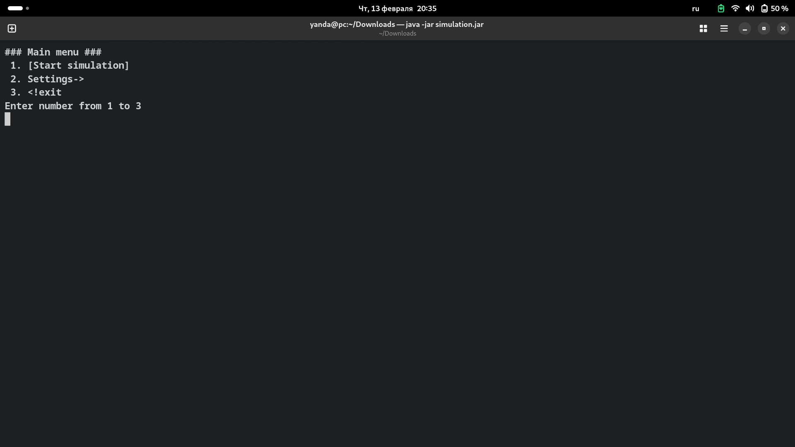

<h2><a href="https://zhukovsd.github.io/java-backend-learning-course/projects/simulation/">Проект “Симуляция”</a></h2>
    <i>Суть проекта - пошаговая симуляция 2D мира, населённого травоядными и хищниками.</i> 
    <i>Кроме существ, мир содержит ресурсы (траву), которыми питаются травоядные, и статичные объекты, с которыми нельзя взаимодействовать - они просто занимают место.</i> 
    <i>2D мир представляет из себя матрицу NxM, каждое существо или объект занимают клетку целиком, нахождение в клетке нескольких объектов/существ - недопустимо.</i>
 

 

 

